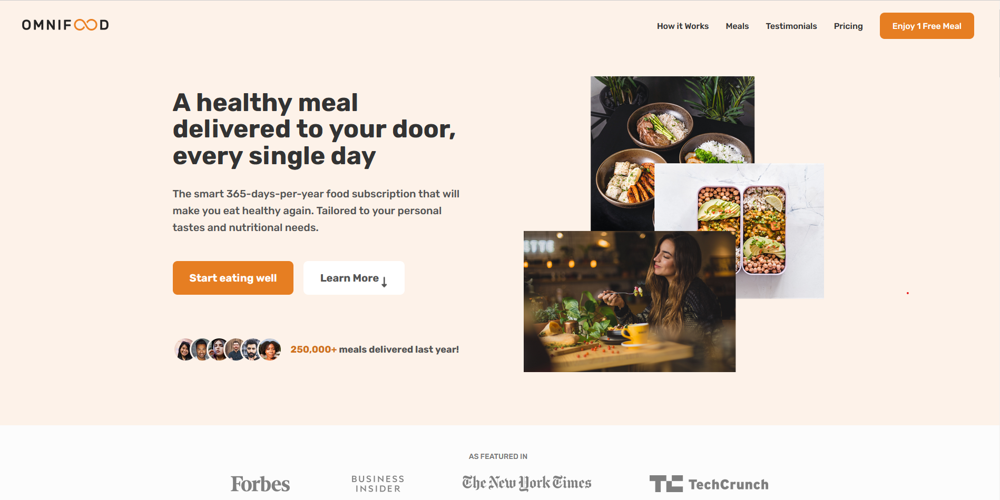
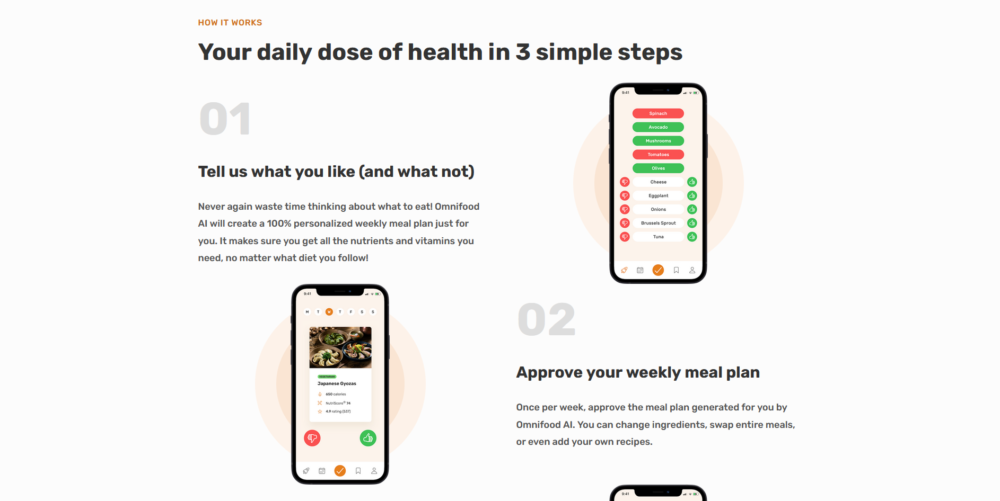
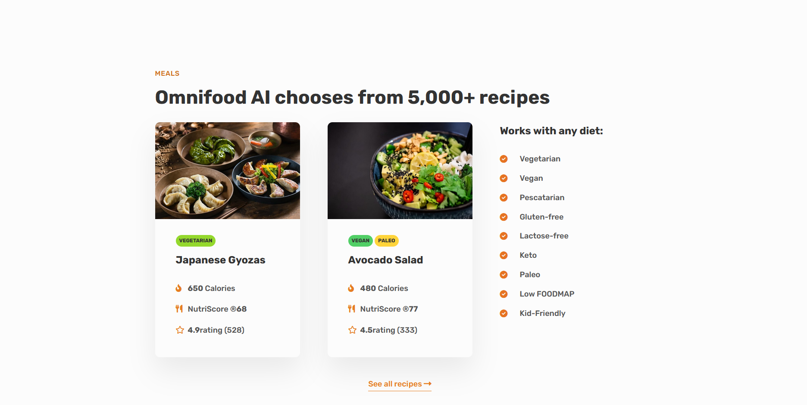
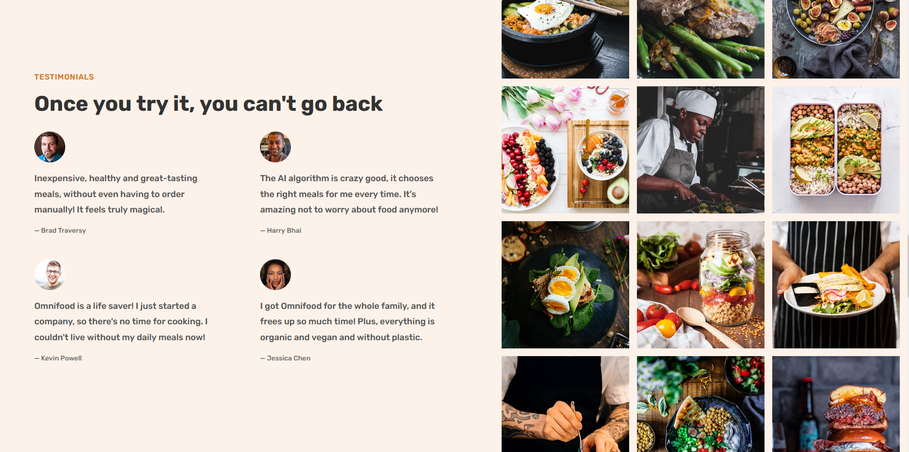
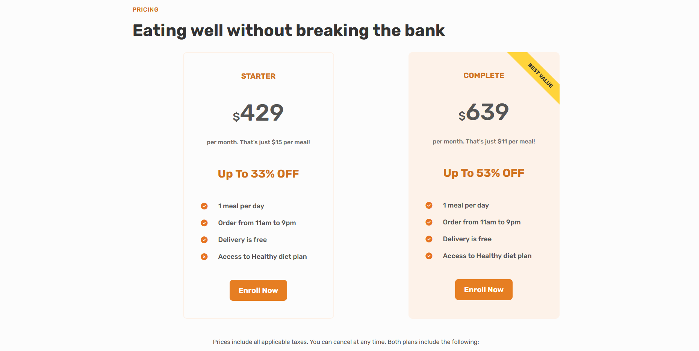
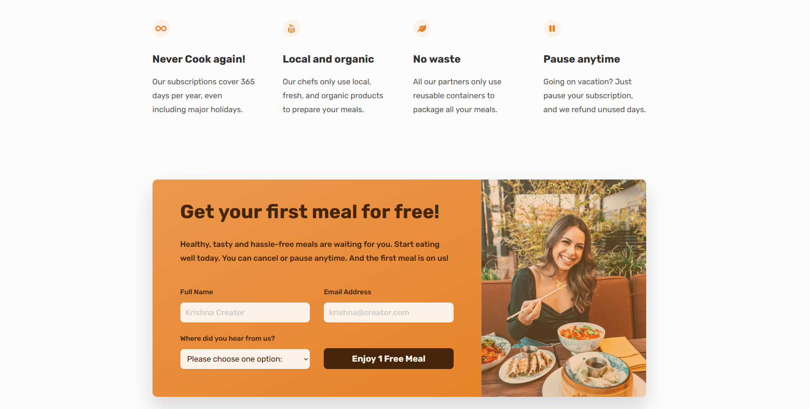
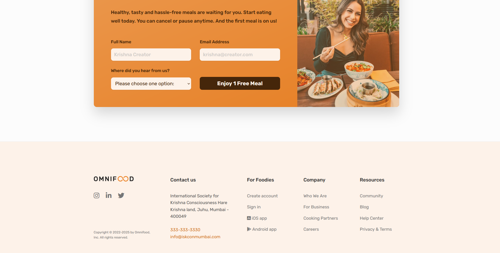

# Responsive OMNIFOOD Marketing Website 

### Responsive OMNIFOOD Website 🍴

- Responsive OMNIFOOD Website Using HTML CSS & JavaScript
- Smooth scrolling in each section.
- Includes a dark and light mode.
- Developed fully responsive and adaptive to any device possible.
- Design and Layout used is based on the Web Design and Development Framework.

### OMNIFOOD Startup Website Preview

#### Navbar & Hero

#### Featured In & How It Works

#### Meals & Diet Plans 😋

#### Testimonials

#### Pricing Plans 💲

#### Order Free Meal & CTA 🎯

#### Footer

I hope you enjoyed the project as much as we all do!

Best Regards!
Nitesh
